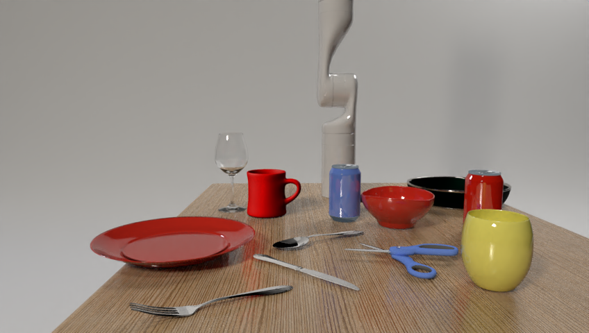

# Embodied question answering 

## Purpose of this repository

The code is shared to illustrate the research presented in our proposed paper
`Embodied Reasoning for Discovering Object Properties via Manipulation`. The 
code is experimental and not tested thoroughly.

## Package structure

### data 

This folder contains part of the data used for the experiments: a [scene description](data/full_table_scene/scenes_V2A.json) 
and 50 questions with the resulting action sequences ([questions](data/full_table_scene/questions.json)).

### scripts

The script [task_execution.py](scripts/task_execution.py) loads for a question the 
scene and action sequence and controls the execution as well as the logging. 

### src/eqa

Python libabries used by the task_execution.py. `action_classes.py` holds classes 
and utility functions to represent scenes, actions, and action sequences. 
The code generation for the action sequences is done [here](src/eqa/action_classes.py) as well.

Skills related to the gripper are defined in [gripper_actions.py](src/eqa/gripper_actions.py).

Skills related to navigating the robotic arm are defined in [manipulator_actions.py](src/eqa/manipulator_actions.py).

## Acknowledgements
This work was supported by the project Interactive Perception-Action-Learning for Modelling Objects (IPALM, https://sites.google.com/view/ipalm) (H2020 -  FET - ERA-NET Cofund - CHIST-ERA III / Technology Agency of the Czech Republic, EPSILON, no. TH05020001).  

 

  
